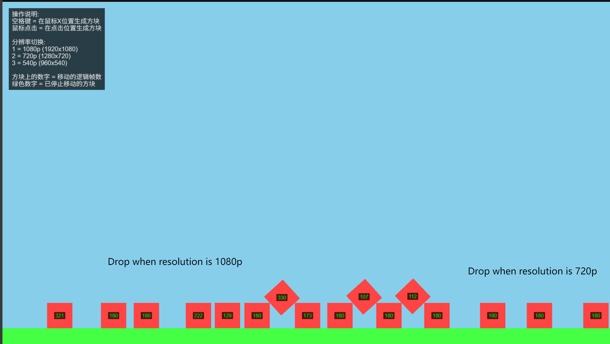

This repo is created from `pnpm create @phaserjs/game@latest`

# Movement in different Resolution test

Phaser4 + @dimforge/rapier2d-deterministic

不同分辨率确定性移动测试

## Versions

dependencies:
@dimforge/rapier2d-deterministic 0.18.2
phaser 4.0.0-rc.5
terser 5.44.0

devDependencies:
typescript 5.7.3
vite 6.3.5
vite-plugin-top-level-await 1.6.0
vite-plugin-wasm 3.5.0

## Available Commands

| Command | Description |
|---------|-------------|
| `npm install` | Install project dependencies |
| `npm run dev` | Launch a development web server |
| `npm run build` | Create a production build in the `dist` folder |
| `npm run dev-nolog` | Launch a development web server without sending anonymous data (see "About log.js" below) |
| `npm run build-nolog` | Create a production build in the `dist` folder without sending anonymous data (see "About log.js" below) |

